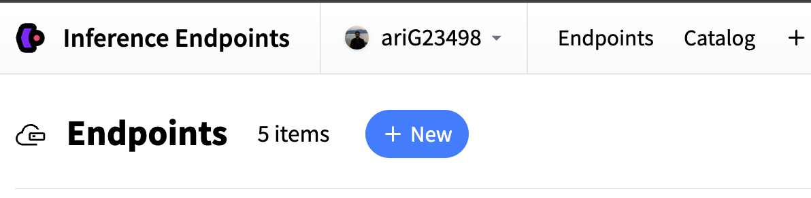
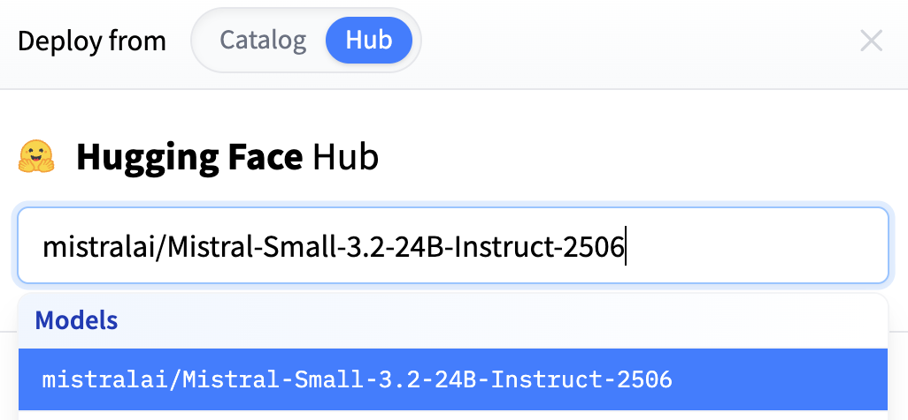
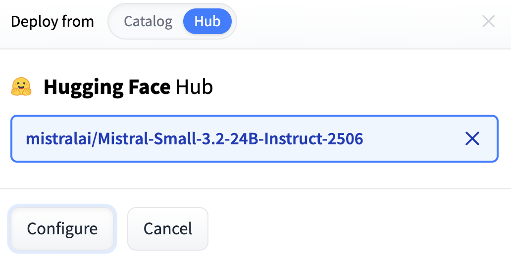
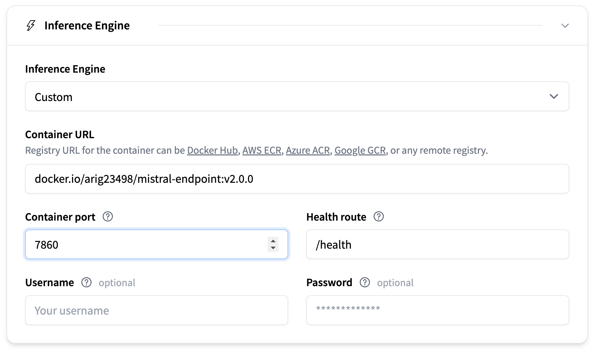

# Deploying a Custom Deep Learning Service (FastAPI + Docker + 🤗 Inference Endpoints)

Deploying a Large Language Model (LLM) is easy with [Inference Endpoints](https://huggingface.co/docs/inference-endpoints/main/en/index), but exposing **custom logic** (custom hidden-state extraction, custom embeddings, custom metadata) is where things get interesting.

This post walks through **building, testing, containerizing, and deploying** a custom text-encoding service using:

* [**Mistral-3-Small**](hf.co/mistralai/Mistral-Small-3.2-24B-Instruct-2506) for encoding
* **FastAPI** for serving
* **Docker** for packaging
* **🤗 Inference Endpoints** for production

The goal: provide a REST endpoint that returns **custom prompt embeddings** and a **custom 4-dim text-ID tensor**, computed exactly the way *you* 🫵🏻 want.

## 1. 🧩 Why Custom LLM Functions Matter

LLM deployments typically expose generation or chat APIs. But real production systems often require **intermediate model artifacts**:

* specific hidden layers
* concatenated embeddings
* custom coordinate encodings
* pre-processing rules
* application-defined text IDs

The [`text_encoding.py`](./text_encoding.py) implements exactly this. It extract hidden states from layers `(10, 20, 30)`, stacks/reshapes them, and attachs custom `text_ids`.

You can test drive the custom function using the following snippet:
```py
from text_encoding import encode_prompt
from transformers import Mistral3ForConditionalGeneration, AutoProcessor

text_enc_id = "mistralai/Mistral-Small-3.2-24B-Instruct-2506"
text_encoder = Mistral3ForConditionalGeneration.from_pretrained(
    text_enc_id, dtype=torch.bfloat16, device_map="cuda"
).eval()

tok_id = "mistralai/Mistral-Small-3.1-24B-Instruct-2503"
tokenizer = AutoProcessor.from_pretrained(tok_id)

prompt = ["hello aritra", "how are you?"]
prompt_embeds, text_ids = encode_prompt(
    text_encoder=text_encoder,
    tokenizer=tokenizer,
    prompt=prompt,
)
```

Having all the logic contained inside of a file (like `text_encoding.py`) gives us the access to test the custom function in isolation.

## 2. ⚙️ Building the FastAPI Application

Now we expose this as an API, by wrapping the custom function `encode_prompt` inside a FastAPI service.

### Key Points

* The model and tokenizer load **once**, inside `FastAPI`’s **lifespan** context.
* Gradients are disabled globally.
* `/predict` returns JSON-compatible tensors.
* Incoming prompts may be a string or list of strings.

### Main Server: [`api.py`](./api.py)

The server:

* Loads the Mistral encoder + processor at startup
* Calls **`encode_prompt()`**, your custom embedding function
* Detaches and moves tensors to CPU for JSON serialization
* Returns shapes + timing
* Runs on CUDA with `bfloat16` data type

This gives the endpoint:

```
POST /predict
{
    "prompt": ["hello world"]
}
```

Returns:

```
{
  "prompt_embeds": [...],
  "text_ids": [...],
  "shapes": { ... },
  "time_ms": ...
}
```


## 3. ⚡ FastAPI Startup Optimization

To ensure the model loads exactly once and the resources are freed on shutdown we use:

```python
@asynccontextmanager
async def lifespan(app):
```

The service is ready before the first request arrives

## 4. 🧪 Local Testing with the Client

The [`client.py`](./client.py) POSTs prompts to the local server and validates output equivalence. While theoratically it should always be the same, it is good practise to setup a testing suite even before serving the model. Having clarity of tought while working on deployments gives you an extra edge.

Let's run the FastAPI server locally and then test for equivalence.
```bash
uvicorn api:app --host 0.0.0.0 --port 8000
python client.py
```

You now have a **validated local API**.

## 5. 🐳 Containerizing the Service

The [`Dockerfile`](./Dockerfile):

* Uses `pytorch/pytorch:2.9.1-cuda12.8-cudnn9-runtime`
* Installs `transformers`, `accelerate`, `fastapi`, `uvicorn`
* Creates `/models` for HF cache
* Copies your app code
* Runs service as non-root user
* Exposes port **7860**

Build:

```bash
docker build -t arig23498/mistral-endpoint .
```

Run locally:

```bash
docker run --gpus all -p 7860:7860 arig23498/mistral-endpoint
```

Test:

```bash
curl http://localhost:7860/
```

## 6. 📦 Push Container to a Registry

Tag the image:

```bash
docker tag arig23498/mistral-endpoint arig23498/mistral-endpoint:v1.0.0
```

Login:

```bash
docker login
```

Push:

```bash
docker push arig23498/mistral-endpoint:v1.0.0
```

Your custom container is now available for deployment.


## 7. ☁️ Deploy to Hugging Face Inference Endpoints

The first step is to create an endpoint. Head over to [inference endpoints](https://endpoints.huggingface.co/) and click on the "+ New" button.

|  |
| :--: |
| Click on the "new" button to create an endpoint |

You will then have a pop up screen for the models to choose from. This is a no-op stage. We can choose anything we like, as this is not dependent on our final deployment. For this example I will choose the `mistralai/Mistral-Small-3.2-24B-Instruct-2506` model from the Hub.

|  |
| :--: |
| Choose any model you like here |

We will now select the "Configure" button to go to the next step.

|  |
| :--: |
| Configure the deployment |

You will be taken to the next page where you can select the Hardware (we select one A100), Authentication (we select public) and other configurations. Here we scroll down to the "Inference Engine" section and select "Custom".

|  |
| :--: |
| Custom inference engine |

As you can see, we fill the "Container URL" with our custom docker URL, and expose the container port.

After this you should be good to hit the "Create Endpoint" button. Once the deployment succeeds your remote URL becomes:

```
https://<endpoint-name>/predict
```

Now you can replace local URL in [`driver.py`](./driver.py):

```python
url = "<REMOTE_URL>/predict"
```

And verify equivalence between **local embeddings** and **remote embeddings**:

```python
torch.testing.assert_close(local_prompt_embeds, remote_prompt_embeds)
torch.testing.assert_close(local_text_ids, remote_text_ids)
```

This proves your endpoint is deterministic and production-ready.
